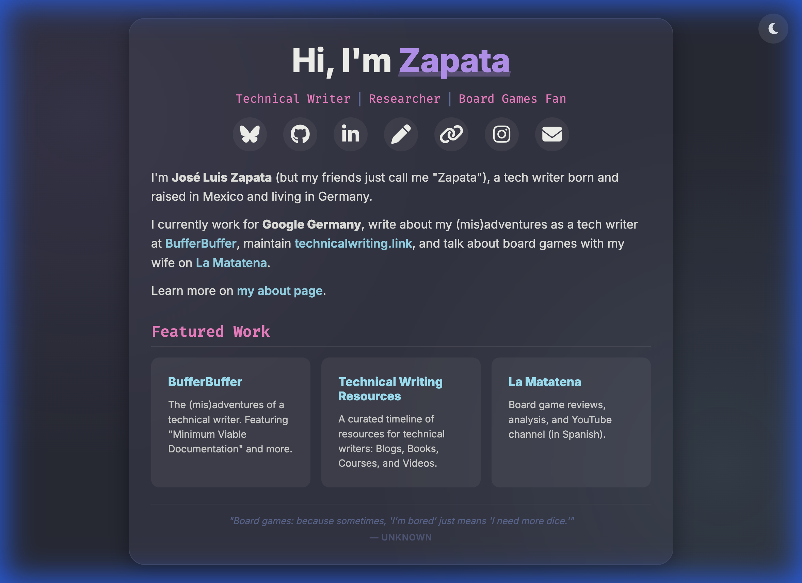

# Modern Minimalist Landing Page (Dracula Edition)

<div align="center">
  

  <br>

  [](https://github.com/zapata131/minimalist-landing-page/actions/workflows/deploy.yml)
  [](https://opensource.org/licenses/MIT)
  [](https://github.com/zapata131/minimalist-landing-page/commits/master)
  [](https://github.com/zapata131/minimalist-landing-page/issues)
  
  <br>

  <h3>
    <a href="https://zapata131.com">🔴 Live Demo</a>
    <span> | </span>
    <a href="https://github.com/zapata131/minimalist-landing-page/issues">🐛 Report Bug</a>
    <span> | </span>
    <a href="https://github.com/zapata131/minimalist-landing-page/pulls">✨ Request Feature</a>
  </h3>
</div>

---

A premium, minimalist landing page template featuring the **Dracula color palette**, glassmorphism aesthetics, and a responsive design. Built with vanilla HTML, CSS, and JavaScript.

## ✨ Features

| Feature | Description |
| :--- | :--- |
| **🎨 Modern Aesthetics** | Sleek glassmorphism effects and modern typography. |
| **🌗 Dark/Light Mode** | Full theme support with system preference detection and persistence. |
| **📱 Fully Responsive** | Optimized for everything from mobile phones up to high-res desktops. |
| **🦋 Social Integration** | Clean icon layout using **Font Awesome 6**. |
| **🏗️ Featured Work** | Built-in grid section for highlighting your top projects. |
| **🏷️ Interactive Tooltips** | Animated hover labels for all social links. |
| **🐣 Easter Egg** | A secret 90s retro mode (try clicking the header title!). |

## 🛠️ Tech Stack

- **HTML5**: Semantic and accessible structure.
- **CSS3**: Modern layouts with Flexbox and Grid, CSS Variables for theming, and smooth animations.
- **JavaScript**: Lightweight vanilla logic for theme switching and easter eggs.
- **Font Awesome 6**: Premium icons.
- **Google Fonts**: Inter (Body) & Fira Code (Technical roles).

## 🚀 Quick Start

1. **Clone the repository**:
   ```bash
   git clone https://github.com/zapata131/minimalist-landing-page.git
   ```
2. **Open `index.html`**:
   Simply open the file in any modern web browser. No complex build steps required!

## 🎨 Customization Guide

### 1. Update Content
Edit `index.html` to change:
- **Title & Bio**: Update the `<h1>` and `<section class="bio">`.
- **Social Links**: Modify the links in the `<div class="social-links">` section. Update the `data-tooltip` attribute for custom hover labels.
- **Projects**: Add or remove items in the `<section class="projects">` grid.

### 2. Tailor the Theme
The site uses **CSS Variables** in `styles.css`. You can easily change the global accent colors or tweak the light mode palette by modifying the `:root` and `body.light-mode` blocks:

```css
:root {
  --bg-color: #282a36;
  --purple: #bd93f9; /* Primary highlight color */
  /* ... */
}
```

### 3. Change Icons
Uses Font Awesome classes. Simply swap the class (e.g., `fab fa-github`) in the social links section.

## 📂 Project Structure

```text
├── index.html   # Main Landing Page
├── styles.css   # Theme variables, animations, and responsive layout
├── script.js    # Theme toggle and easter egg logic
├── assets/      # Project images (screenshots, etc.)
├── icons/       # Favicon and local font assets
└── CONTEXT.md   # Project metadata and keywords
```

## 📜 License

This project is under the **MIT License**. Feel free to use and adapt it for your own personal or professional portfolio!
